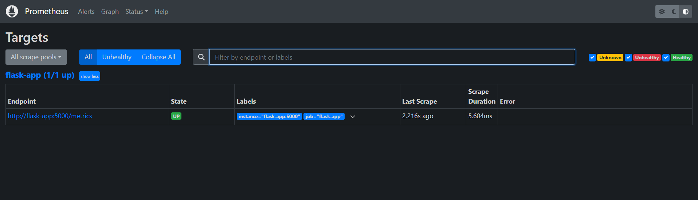
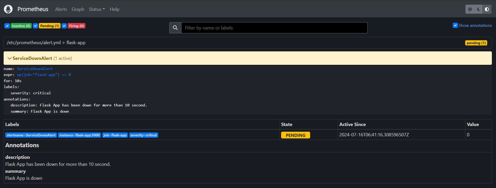
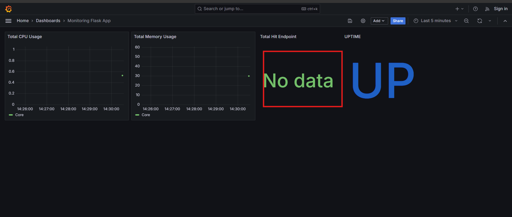

# Monitoring Flask with Prometheus and Grafana
## Prerequisite
- Docker 
- Docker-compose

## Step 
- Jalankan Semua service menggunakan perintah berikut
```bash
    docker-compose up -d
```
- Berikut adalah port untuk masing-masing service
    * localhost:5000 (service flask-app)   
    * localhost:9090 (service prometheuse)   
    * localhost:3000 (service grafana)   

- Untuk mengakses Metrics yang berada pada *flask-app* menggunakan endpoint berikut *localhost:5000/metrics*

- Berikut ini endpoint dalam service yang bisa oleh metric pada prometheus:
    * http://localhost:5000/one
    * http://localhost:5000/two
    * http://localhost:5000/error

- Hit Semua endpoint agar dapat mengenerate data yang akan ditampilkan dalam dashboard grafana, semua endpoint menggunakan method get jadi bisa di hit menggunakan web browser

- metrics yang dari service *flask-app* sudah di import ke prometheus traget untuk melihat sudah berjalan dengan baik bisa menggunakan alamat prometheus berikut : http://prometheus:9090/targets
<div align="center">
      
</div>


- import dashboard yang dengan file berikut [dashboard](./grafana/dashboard.json)

- Untuk testing Alerting menggunakan uptime dari service *flash-app* yang di matikan, alerting akan berstatus seperti berikut : 
 <div align="center">
      
</div>

---
**IMPORTANT!**

1. Ada beberapa bug ketika mengimport dashboard, dikarenakan pada project ini menggunakan grafana dan prometheus local sehingga kita harus mengulangi langkah untuk setiap panel pada dashboard agar *uid* dari datasource bisa berubah, ketika mengimport dashboard awal akan terjadi error untuk setiap panel seperti berikut :
<div align="center">
      
</div>

2. Update query panel seperti manambahkan spasi atau kemudian jalan kembali query nya
3. Save maka perubahan dan panel akan terupdate dengan data terbaru 

---
- Untuk mematikan semua service menggunakan perintah berikut:
```bash
    docker-compose down
```